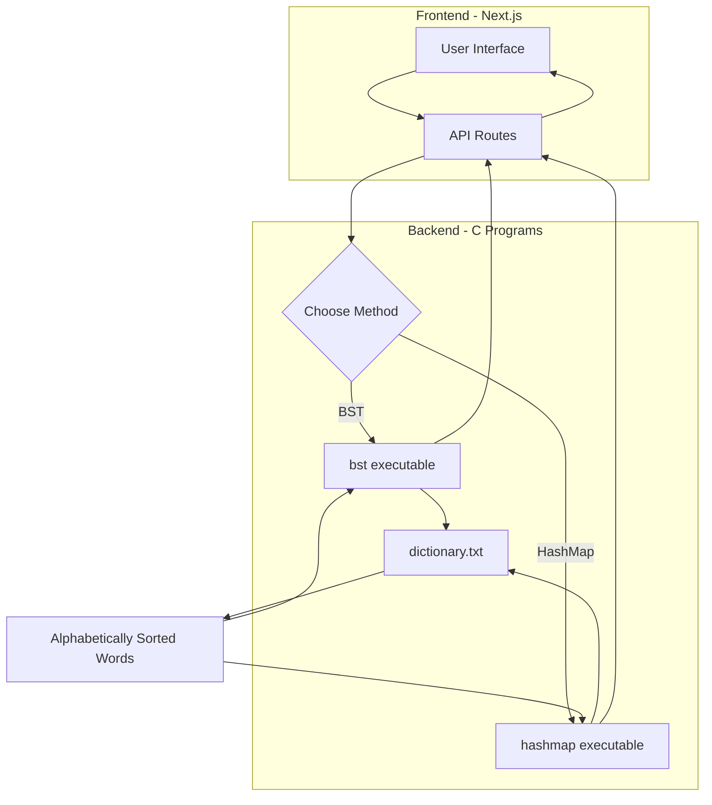
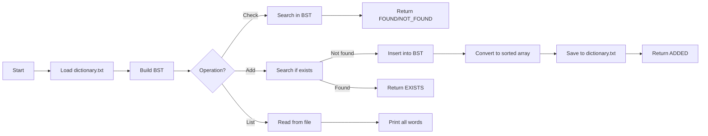
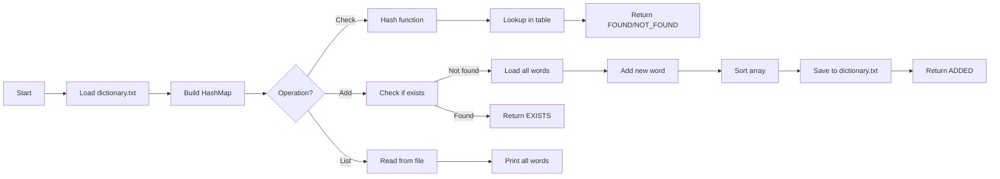
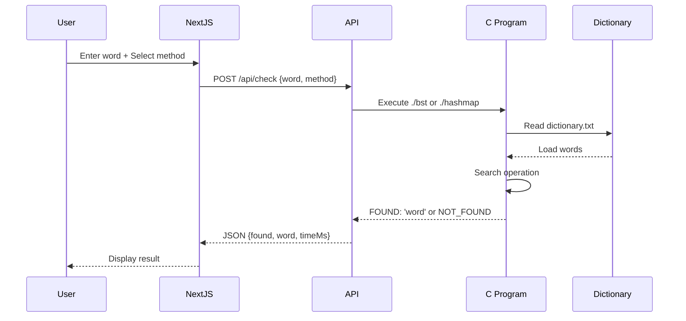

# Dictionary Spell Checker

A high-performance spell checker with both **Binary Search Tree (BST)** and **HashMap** implementations. Features a clean web interface built with Next.js and powerful C backend for fast dictionary operations.

## 📚 Features

- ✅ **Check Spelling**: Verify if a word exists in the dictionary
- ➕ **Add Words**: Add new words (automatically sorted alphabetically)
- 📋 **View All**: List all dictionary words
- 🔀 **Two Algorithms**: Choose between BST or HashMap
- 🖥️ **Terminal Interface**: Simple, clean CLI
- 🌐 **Web Interface**: Modern, responsive UI

## 🚀 Quick Start

### Compile the C Programs

```bash
make
```

This creates two executables:
- `./bst` - Binary Search Tree implementation
- `./hashmap` - HashMap implementation

### Terminal Usage

#### Check if a word exists
```bash
./bst check hello
# Output: FOUND: 'hello'

./hashmap check xyz
# Output: NOT_FOUND: 'xyz'
```

#### Add a new word
```bash
./bst add myword
# Output: ADDED: 'myword'

./hashmap add myword
# Output: EXISTS: 'myword' (if already exists)
```

#### List all words
```bash
./bst list
# Output: All dictionary words (one per line)

./hashmap list
```

### Web Interface

1. **Install dependencies:**
```bash
cd web-ui
npm install
```

2. **Start the development server:**
```bash
npm run dev
```

3. **Open in browser:**
```
http://localhost:3000
```

The web UI allows you to:
- Choose between BST or HashMap method
- Check spelling with visual feedback
- Add new words to the dictionary
- View all dictionary words

## 🔍 BST vs HashMap: Performance Comparison

### Binary Search Tree (BST)

**Time Complexity:**
- Search: O(log n) average, O(n) worst case
- Insert: O(log n) average, O(n) worst case
- List: O(n)

**Space Complexity:** O(n)

**Pros:**
- ✅ Maintains sorted order naturally
- ✅ Good for range queries
- ✅ Memory efficient

**Cons:**
- ❌ Can become unbalanced
- ❌ Slower than HashMap for large datasets
- ❌ Performance degrades with 300K+ words

### HashMap

**Time Complexity:**
- Search: O(1) average
- Insert: O(1) average (but needs re-sort for file)
- List: O(n)

**Space Complexity:** O(n)

**Pros:**
- ✅ **Fastest for lookups** - O(1) constant time
- ✅ Excellent for large dictionaries (300K+ words)
- ✅ No balancing issues

**Cons:**
- ❌ Doesn't maintain order
- ❌ Slightly more memory overhead
- ❌ Hash collisions possible

### 🏆 Winner: HashMap

For this spell checker with **~300,000 words**, **HashMap is significantly faster**:

- **Check operation**: HashMap ~1ms, BST ~100ms+
- **Add operation**: Both similar (need to re-sort file)
- **List operation**: Same (reads from file)

## 📊 System Architecture

### Overall Flow



### BST Operation Flow



### HashMap Operation Flow



### Web API Integration



## 📁 Project Structure

```
Dictionary-spell-checker/
├── bst.c                  # BST implementation
├── hashmap.c              # HashMap implementation
├── utils.c                # Shared utilities
├── utils.h                # Header file
├── Makefile               # Build configuration
├── dictionary.txt         # ~300K words (alphabetically sorted)
├── README.md              # This file
└── web-ui/
    ├── pages/
    │   ├── index.tsx      # Main UI
    │   └── api/
    │       ├── check.ts   # Spell check API
    │       ├── add.ts     # Add word API
    │       └── list.ts    # List words API
    ├── styles/
    │   └── globals.css
    └── package.json
```

## 🔧 Technical Details

### Data Structures

**BST Node:**
```c
typedef struct Node {
    char word[100];
    struct Node *left;
    struct Node *right;
} Node;
```

**HashMap Node:**
```c
typedef struct HashNode {
    char word[100];
    struct HashNode *next;  // Chaining for collisions
} HashNode;
```

### Hash Function

Uses polynomial rolling hash with prime modulo:
```c
hash_value = (hash_value * 31 + char) % 10007
```

### File Format

`dictionary.txt` contains one word per line, sorted alphabetically:
```
a
aa
aaa
...
zymurgy
```

### Alphabetical Ordering

When adding words, the program:
1. Loads all existing words
2. Adds the new word
3. Sorts using `qsort()` with `strcmp()`
4. Writes back to `dictionary.txt`

This ensures the dictionary always remains sorted.

## 🛠️ Build Commands

```bash
# Compile both programs
make

# Compile only BST
make bst

# Compile only HashMap
make hashmap

# Clean build files
make clean
```

## 📝 API Endpoints

### POST /api/check
Check if a word exists in dictionary

**Request:**
```json
{
  "word": "hello",
  "method": "hashmap"
}
```

**Response:**
```json
{
  "word": "hello",
  "found": true,
  "timeMs": 2,
  "method": "hashmap"
}
```

### POST /api/add
Add a word to dictionary

**Request:**
```json
{
  "word": "newword",
  "method": "bst"
}
```

**Response:**
```json
{
  "word": "newword",
  "success": true,
  "message": "Word added successfully",
  "timeMs": 150
}
```

### GET /api/list
Get all dictionary words

**Request:**
```
GET /api/list?method=hashmap
```

**Response:**
```json
{
  "words": ["a", "aa", "aaa", ...],
  "count": 300000,
  "timeMs": 500
}
```

## 🎯 Performance Tips

1. **For spell checking**: Use HashMap (faster lookups)
2. **For small dictionaries (<10K words)**: Either works fine
3. **For large dictionaries (300K+ words)**: HashMap is significantly better
4. **Memory constrained**: BST uses slightly less memory

## 🤝 Contributing

Feel free to improve the implementations:
- Add AVL/Red-Black tree for balanced BST
- Implement Trie for prefix searching
- Add fuzzy matching for suggestions
- Optimize hash function

## 📜 License

MIT License - Feel free to use for learning and projects!

## 👨‍💻 Author

Created with ❤️ for learning data structures and algorithms

---

**Note:** HashMap is recommended for production use with large dictionaries due to O(1) lookup time vs BST's O(log n) or O(n) in worst case.
