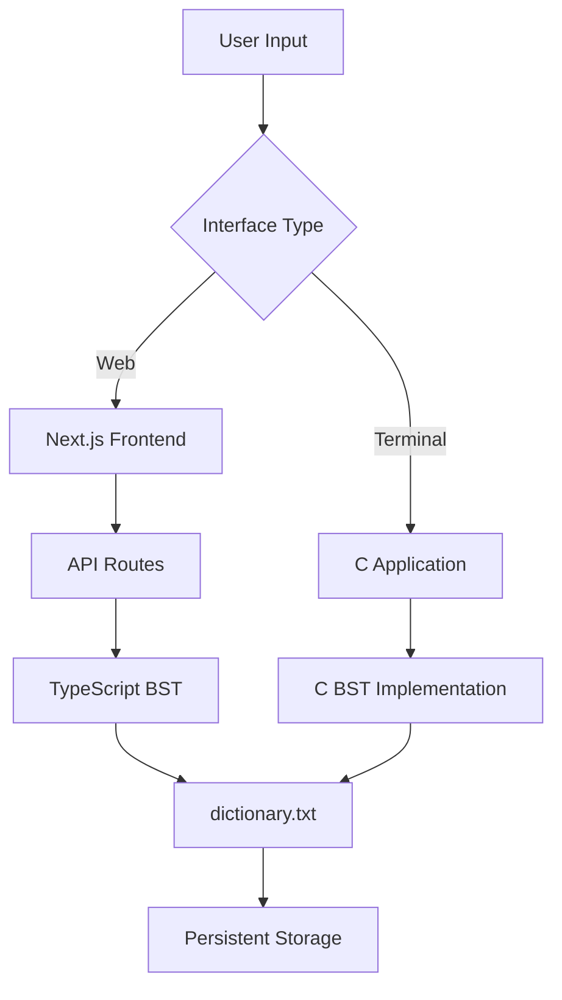
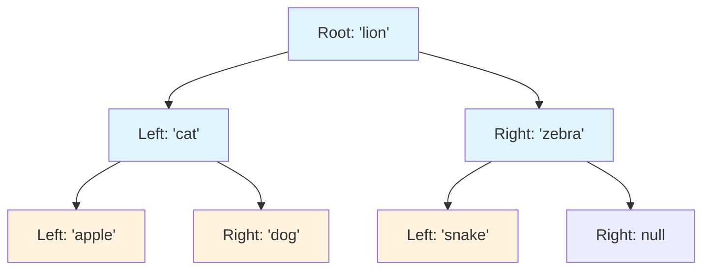
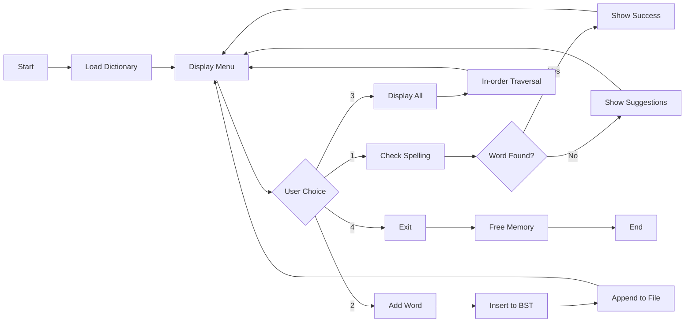
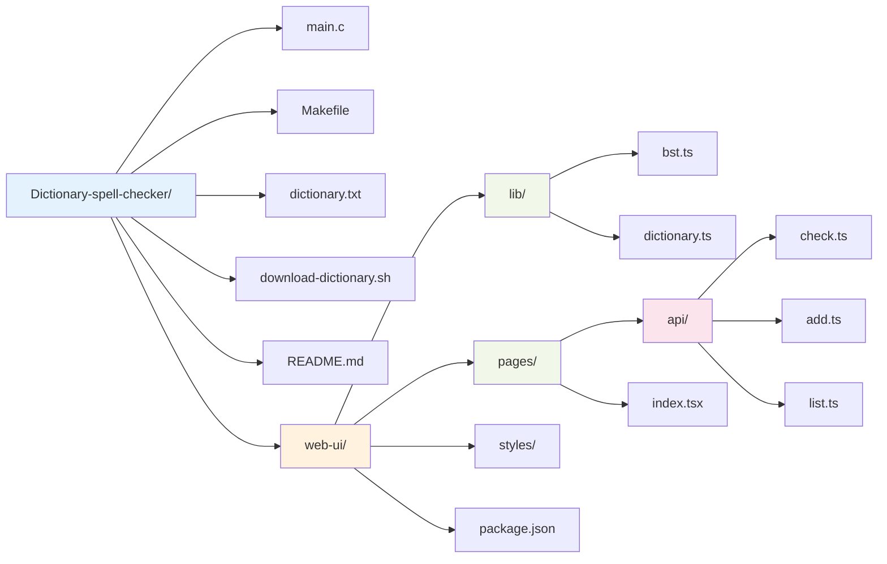
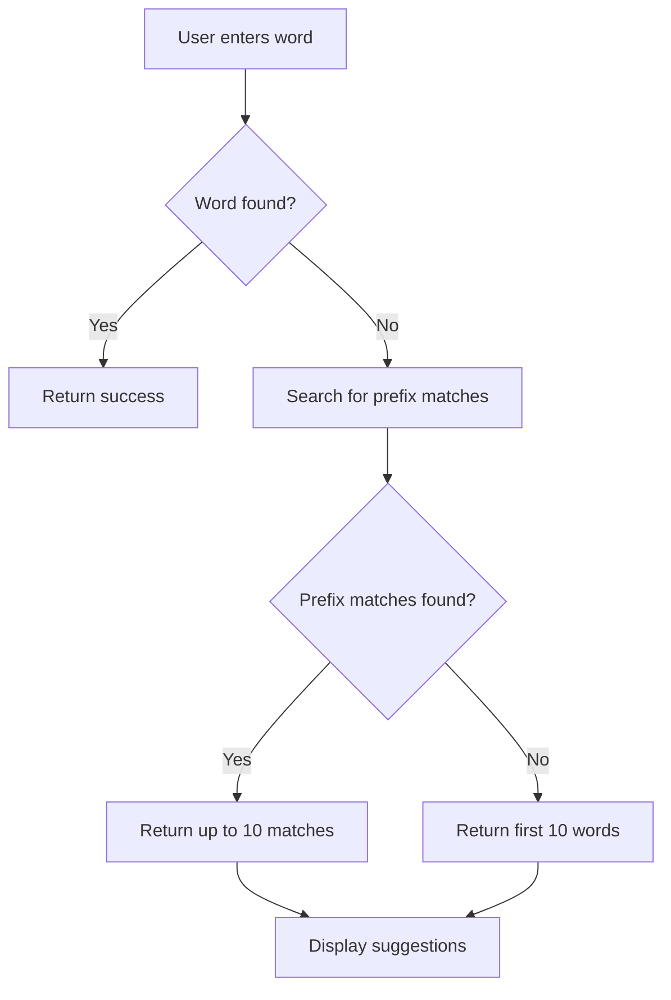

# Dictionary Spell Checker

A comprehensive spell-checking application with both **terminal (C)** and **web (Next.js)** interfaces, implementing a Binary Search Tree (BST) for efficient word lookup.

## Overview

This project provides two interfaces for spell-checking functionality:

### 1. Terminal Application (C)
Command-line interface with ANSI color support

### 2. Web Application (Next.js)
Modern browser-based UI running on `localhost:3000`

---

## Features

Both interfaces share these core features:
- Check if a word is spelled correctly (case-insensitive)
- Add new words to the dictionary
- Display all words in alphabetical order (in-order BST traversal)
- Smart suggestions for misspelled words (prefix matching)
- Persistent storage in `dictionary.txt`

### Terminal App
- Colorful ANSI output
- Lightweight and fast
- Zero dependencies

### Web App
- Modern, responsive UI with Tailwind CSS
- Click suggestions to quickly check them
- Mobile-friendly design

---

## Quick Start

### Terminal Application

Build and run the C program:

```bash
make
./spellchecker
```

### Web Application

Navigate to `web-ui` and start the Next.js dev server:

```bash
cd web-ui
npm install
npm run dev
```

Then open `http://localhost:3000` in your browser.

---

## Architecture

### System Flow



### Data Structure: Binary Search Tree



### Application Workflow



---

## Why Binary Search Tree?

- **Ordered structure**: BST keeps words in sorted order automatically
- **In-order traversal**: Prints words alphabetically without additional sorting
- **Efficient operations**: Average O(log n) for search, insert, and delete (balanced tree)
- **Simple implementation**: Easy to understand and maintain

**Note**: For very large dictionaries, consider balanced trees (AVL/Red-Black) or tries for guaranteed O(log n) performance.

---

## Terminal Application Usage

### Build

```bash
make
```

This compiles `main.c` into the `spellchecker` executable.

### Run

```bash
./spellchecker
```

### Interactive Menu

The terminal app presents a menu interface:

```
╔════════════════════════════════════════╗
║   Dictionary Spell Checker             ║
╚════════════════════════════════════════╝

1) Check spelling
2) Add new word to dictionary  
3) Display all dictionary words
4) Exit
```

**Option 1: Check Spelling**
- Enter a word (e.g., `Cat`)
- Case-insensitive matching
- Shows success message if correct or suggestions if not found

**Option 2: Add Word**
- Enter a new word
- Adds to in-memory BST and appends to `dictionary.txt`

**Option 3: Display All**
- Shows all words in alphabetical order
- Color-coded output

**Option 4: Exit**
- Safely exits and frees memory

### Example Session

```bash
$ ./spellchecker

Enter choice: 1
Enter word to check: hello
'hello' is spelled correctly!

Enter choice: 1  
Enter word to check: helo
'helo' is NOT found in the dictionary.

Suggestions:
  -> hello
  -> help
  -> held

Enter choice: 2
Enter new word to add: helo
'helo' added to dictionary and saved to file!

Enter choice: 4
Goodbye! Exiting...
```

---

## Web Application Usage

### Setup

```bash
cd web-ui
npm install
```

### Run Development Server

```bash
npm run dev
```

Open `http://localhost:3000` in your browser.

### Production Build

```bash
npm run build
npm start
```

### Using the Web Interface

1. **Check Spelling**: Type a word in the input field and click "Check Spelling" (or press Enter)
2. **Add Word**: Click "Add Word" to add the current word to the dictionary
3. **View All**: Click "View All" to see the entire dictionary in a modal
4. **Click Suggestions**: When a word is misspelled, click any suggestion chip to check it

The web app features:
- Real-time feedback
- Color-coded results (green for correct, red for not found)
- Clickable suggestion chips
- Responsive layout for mobile/desktop

---

## Project Structure



### Directory Layout

```
Dictionary-spell-checker/
├── main.c                    # C implementation with BST
├── Makefile                  # Build configuration
├── dictionary.txt            # Word list (shared by both apps)
├── download-dictionary.sh    # Script to get comprehensive word list
├── README.md                 # This file
└── web-ui/                   # Next.js web application
    ├── lib/
    │   ├── bst.ts           # TypeScript BST implementation
    │   └── dictionary.ts    # Dictionary loader/saver
    ├── pages/
    │   ├── api/
    │   │   ├── check.ts     # Spell check endpoint
    │   │   ├── add.ts       # Add word endpoint
    │   │   └── list.ts      # List words endpoint
    │   ├── _app.tsx         # App wrapper
    │   └── index.tsx        # Main UI page
    ├── styles/
    │   └── globals.css      # Tailwind CSS
    ├── package.json
    └── README.md            # Web app specific docs
```

---

## Expanding the Dictionary

The default `dictionary.txt` has only ~28 words for testing. To use a comprehensive English dictionary:

### Download Full Word List

```bash
./download-dictionary.sh
```

This downloads ~**466,000 English words** from [dwyl/english-words](https://github.com/dwyl/english-words).

### Integration Options

**Option 1: Replace**
```bash
mv dictionary-full.txt dictionary.txt
```

**Option 2: Merge**
```bash
cat dictionary.txt dictionary-full.txt | sort -u > dictionary-merged.txt
mv dictionary-merged.txt dictionary.txt
```

**Option 3: Keep both** (recommended)

---

## Implementation Details

### Case Handling
All words are lowercased automatically. `Cat` and `cat` are treated the same.

### Dictionary File
- Both apps read from `dictionary.txt`
- New words are appended when added
- Changes persist across sessions

### Suggestions Algorithm



Algorithm steps:
1. Find words with matching prefix (up to 10)
2. If no prefix matches, show first 10 words alphabetically
3. Simple and fast for most use cases

### Performance Complexity

| Operation | Average Case | Worst Case | Space |
|-----------|-------------|------------|-------|
| Search    | O(log n)    | O(n)       | O(1)  |
| Insert    | O(log n)    | O(n)       | O(1)  |
| Delete    | O(log n)    | O(n)       | O(1)  |
| Traversal | O(n)        | O(n)       | O(n)  |

**Notes:**
- Average case assumes a balanced BST
- Worst case occurs with sorted input (degenerates to linked list)
- For large dictionaries, consider AVL or Red-Black tree for guaranteed O(log n)

---

## Future Enhancements

### Suggestions
- Levenshtein distance for smarter corrections
- Phonetic matching (Soundex, Metaphone)
- N-gram based similarity

### Performance
- Balanced BST (AVL/Red-Black tree)
- Trie data structure for prefix queries
- Hash table for O(1) lookup

### Features
- Word definitions via external API
- Multiple language support
- User authentication and personal dictionaries
- Import/export functionality
- Word frequency analysis
- Autocomplete functionality

---

## Development

### Clean Build

```bash
make clean
make
```

### Testing

Terminal app:
```bash
echo -e "1\ntest\n4" | ./spellchecker
```

Web app:
```bash
cd web-ui
npm run build
npm test  # if tests are added
```

### API Endpoints

| Endpoint | Method | Description |
|----------|--------|-------------|
| `/api/check` | POST | Check if word exists, return suggestions |
| `/api/add` | POST | Add new word to dictionary |
| `/api/list` | GET | Get all words in alphabetical order |

---

## License

This project is open source and available for educational purposes.

---

## Contributing

Contributions are welcome! Suggested improvements:
- Add unit tests
- Implement Levenshtein distance
- Create mobile app version
- Add word frequency analysis
- Implement autocomplete
- Add multi-language support

---

## Acknowledgments

- Dictionary word list from [dwyl/english-words](https://github.com/dwyl/english-words)
- Built with C, Next.js, TypeScript, and Tailwind CSS

